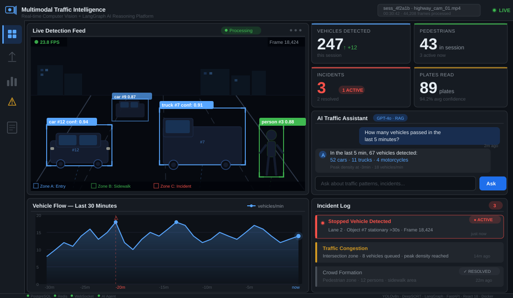

# Multimodal Traffic Intelligence Platform

[](https://github.com/Bharathkondur/Multimodal-Traffic-Intelligence-platform/actions)
[](https://opensource.org/licenses/MIT)
[](https://www.python.org/downloads/)
[](https://www.docker.com/)

## Dashboard Preview



## Overview

The Multimodal Traffic Intelligence Platform is a real-time intelligent video analysis system that goes beyond detection. It combines computer vision and natural language reasoning to understand traffic scenes at scale.

**Two AI layers working together:**

1. **Vision Layer**: OpenCV-based stream processing with YOLOv8 for multi-object detection, plate recognition, and incident identification
2. **Reasoning Layer**: LangGraph-powered agent that performs RAG (Retrieval-Augmented Generation) over detection events, queries patterns, and generates natural-language reports

Upload a video, get detections with real-time dashboards, ask questions about the scene, receive intelligent shift reports. All from a single integrated platform.

### Key Capabilities

- Real-time vehicle, pedestrian, and cyclist detection and tracking
- Automatic license plate recognition and extraction
- Intelligent incident detection (stopped vehicles, congestion, crowd formations, accidents)
- Natural language Q&A over detection data
- Automated shift report generation with actionable insights
- Live WebSocket streaming to React dashboard
- Configurable LLM backend (OpenAI GPT-4o or Ollama for local inference)
- Production-ready Grafana analytics dashboards
- One-command Docker Compose deployment

## Demo Flow

```
1. Upload Video
   └─> Video ingested and queued for processing

2. Real-Time Detection Pipeline
   ├─> Stream decomposed into frames (configurable skip rate)
   ├─> YOLOv8 detects vehicles, pedestrians, cyclists, animals
   ├─> DeepSORT tracker maintains object identities across frames
   ├─> Plate reader extracts license plates from vehicles
   └─> Event stream persisted to PostgreSQL

3. Incident Detection
   ├─> Stopped vehicle detector identifies stationary objects
   ├─> Congestion analyzer detects traffic flow issues
   ├─> Crowd detector identifies gatherings
   └─> Accident classifier flags collision patterns

4. Live Dashboard (React + WebSocket)
   ├─> Frame-by-frame detection visualization
   ├─> Real-time metrics (vehicles/min, incidents/session)
   ├─> Interactive filters and timeline scrubbing
   └─> Chat interface for Q&A

5. Ask Questions
   ├─> Natural language query: "How many vehicles passed between minute 5 and 10?"
   ├─> Agent retrieves relevant detection events from PostgreSQL
   ├─> RAG context built from event data
   ├─> LLM analyzes pattern and generates response
   └─> Answer returned with confidence and supporting data

6. Generate Reports
   ├─> Automatic shift report: "Traffic Summary for [Date]"
   ├─> Statistics: vehicle counts, incident frequency, peak times
   ├─> Insights: congestion patterns, anomalies detected
   ├─> Exportable as PDF/JSON
   └─> Stored in database for audit trail
```

## Architecture

```
VIDEO INPUT
    |
    v
OpenCV Stream Processor
    |
    +-----> YOLOv8 Detector (torch-based, GPU-optimized)
    |           |
    |           v
    |       Detection Results
    |           |
    |           +-----> Object Tracker (DeepSORT)
    |           |           |
    |           |           v
    |           |       Tracked Objects
    |           |
    |           +-----> Plate Reader (EasyOCR)
    |               |
    |               v
    |           License Plates
    |
    +-----> Incident Detector
                |
                +-----> Stopped Vehicle Analyzer
                +-----> Congestion Analyzer
                +-----> Crowd Detector
                +-----> Accident Classifier
                        |
                        v
                    Incident Events


All Events & Detections
    |
    v
PostgreSQL Event Store (Persistence Layer)
    |
    +-----> Detection Table (frame-by-frame)
    +-----> Incident Table
    +-----> Session Table
    +-----> Plate Table
    +-----> Metrics Table
    |
    v
Redis Cache (Recent events, session data)


User Interaction Layer
    |
    +-----> React Dashboard (WebSocket client)
    |           |
    |           v
    |       Live Detection Visualization
    |       Real-time Metrics
    |       Timeline Controls
    |
    +-----> FastAPI Backend (REST + WebSocket)
    |           |
    |           +-----> /sessions/* (manage video sessions)
    |           +-----> /detections/* (retrieve detection data)
    |           +-----> /incidents/* (query incidents)
    |           +-----> /chat (natural language Q&A)
    |           +-----> /reports (shift reports)
    |           +-----> /metrics (analytics)
    |
    +-----> LangGraph Agent
                |
                +-----> RAG System (vector search over events)
                +-----> Tool Definitions
                |       ├─ query_detections
                |       ├─ query_incidents
                |       ├─ get_metrics
                |       ├─ temporal_analysis
                |       └─ generate_insights
                |
                +-----> LLM (OpenAI or Ollama)
                        |
                        v
                    Natural Language Responses


Analytics & Monitoring
    |
    +-----> Grafana Dashboards
    |       ├─ Vehicle Flow (time-series)
    |       ├─ Incident Timeline
    |       ├─ Peak Hours Analysis
    |       └─ System Health
    |
    +-----> Prometheus Metrics
            ├─ Processing throughput
            ├─ Detection latency
            ├─ Error rates
            └─ Resource usage
```

## Tech Stack

| Component | Technology | Purpose |
|-----------|-----------|---------|
| **Backend API** | FastAPI 0.104+ | RESTful endpoints + WebSocket streaming |
| **Video Processing** | OpenCV 4.8+ | Stream decomposition, frame extraction |
| **Object Detection** | YOLOv8 (PyTorch) | Real-time vehicle/pedestrian detection |
| **Tracking** | DeepSORT | Multi-object tracking with identity persistence |
| **Plate Recognition** | EasyOCR + TensorFlow | License plate extraction and text recognition |
| **AI/Reasoning** | LangGraph + LangChain | Agentic RAG pipeline for Q&A |
| **LLM Integration** | OpenAI GPT-4o / Ollama | Natural language understanding and generation |
| **Database** | PostgreSQL 16 | Event store, session persistence, metrics |
| **Cache** | Redis 7 | Real-time data cache, session state |
| **Frontend** | React 18 + TypeScript | Interactive dashboard and UI |
| **Visualization** | Recharts | Charts and analytics on dashboard |
| **Analytics** | Grafana + Prometheus | Production monitoring and dashboards |
| **Container Orchestration** | Docker Compose | Multi-service deployment |
| **Web Server** | Nginx | Reverse proxy and static file serving |
| **Async Runtime** | Uvicorn + asyncio | High-performance async request handling |
| **ORM** | SQLAlchemy 2.0+ | Database abstraction and query building |

## Features

### Vision-Based Detection
- **Multi-class detection**: Vehicles, pedestrians, cyclists, animals
- **Real-time performance**: GPU-accelerated YOLOv8 inference
- **Configurable confidence**: Adjustable detection thresholds per model
- **Batch processing**: Handle up to 100 detections per frame
- **Frame skipping**: Configurable frame skip rate to optimize throughput

### Tracking & Identity
- **DeepSORT tracking**: Maintain object identity across video frames
- **Occlusion handling**: Robust to temporary obstructions
- **ID assignment**: Unique identifiers for vehicles across session
- **Trail rendering**: Historical trajectory visualization on dashboard

### License Plate Recognition
- **Plate detection**: Specialized detector for plate regions
- **OCR extraction**: EasyOCR-based text recognition
- **Confidence scoring**: Validate extracted plate strings
- **Database storage**: Searchable plate archive for queries

### Incident Detection
- **Stopped vehicles**: Identify stationary objects in traffic
- **Congestion detection**: Cluster analysis for traffic density
- **Crowd detection**: Identify pedestrian aggregations
- **Anomaly flagging**: Alert on unusual patterns

### Intelligent Analysis Layer
- **RAG pipeline**: Retrieve relevant events for context
- **Vector embeddings**: Semantic search over detection events
- **Tool-based reasoning**: Agent can query, filter, and analyze data
- **Natural language**: Ask "What happened between minute 5-10?" get intelligent responses
- **Incident analysis**: Automatic root cause analysis of detected incidents

### Reporting
- **Shift reports**: Automated summaries per time period
- **Export formats**: JSON and PDF output
- **Customizable templates**: Define report structure
- **Timestamp-aware**: Correlate with specific video timestamps

### Real-Time Streaming
- **WebSocket integration**: Live dashboard updates
- **Frame delivery**: Send annotated frames to clients
- **Metric streaming**: Push metrics as they're computed
- **Scalable design**: Multiple concurrent WebSocket clients

### Monitoring & Analytics
- **Grafana dashboards**: Pre-configured visualization templates
- **Prometheus metrics**: Detection throughput, latency, error rates
- **Health checks**: Service health endpoints
- **Performance tracking**: Frame processing rate, GPU utilization

## Quick Start

### Prerequisites
- Docker & Docker Compose (recommended)
- Python 3.11+ (for local development)
- GPU with CUDA support (optional, for faster inference)

### Using Docker Compose (Recommended)

1. Clone the repository:
```bash
git clone https://github.com/Bharathkondur/Multimodal-Traffic-Intelligence-platform.git
cd "Multimodal-Traffic-Intelligence-platform"
```

2. Set up environment:
```bash
cp .env.example .env
# Edit .env with your configuration (API keys, passwords, etc.)
```

3. Start all services:
```bash
docker-compose up -d
```

4. Initialize database:
```bash
docker-compose exec backend python -m backend.database.init_db
```

5. Open dashboard:
```
Frontend: http://localhost:3000
Grafana: http://localhost:3001 (admin/admin_password_change_me)
API Docs: http://localhost:8000/docs
```

6. Upload a video:
   - Navigate to http://localhost:3000
   - Click "Upload Video"
   - Select an MP4, AVI, or MOV file
   - Wait for processing (watch dashboard for real-time updates)

7. Query the results:
   - Use the chat interface on dashboard
   - Try: "How many vehicles were detected?"
   - Or: "Summarize any incidents"

### Local Development (without Docker)

1. Install Python dependencies:
```bash
pip install -e ".[dev]"
pip install -r backend/agents/requirements.txt
```

2. Start PostgreSQL and Redis:
```bash
docker-compose up postgres redis -d
```

3. Initialize database:
```bash
python backend/database/init_db.py
```

4. Start backend:
```bash
uvicorn backend.main:app --reload --host 0.0.0.0 --port 8000
```

5. In another terminal, start frontend:
```bash
cd frontend
npm install
npm start
```

## API Reference

### Session Management

**POST /api/v1/sessions/upload**
- Upload video file and start processing
- Parameters: `file` (video), `name` (optional session name)
- Returns: Session ID, status, estimated processing time

**GET /api/v1/sessions/{session_id}**
- Retrieve session details and metadata
- Returns: Session info, progress, detection count, incident count

**GET /api/v1/sessions**
- List all sessions with pagination
- Query parameters: `skip`, `limit`, `status` (processing/completed/failed)
- Returns: Paginated session list

**DELETE /api/v1/sessions/{session_id}**
- Delete session and associated data
- Returns: Confirmation

### Detection Data

**GET /api/v1/detections/{session_id}**
- Retrieve all detections for a session
- Query parameters: `frame_range`, `class_filter`, `confidence_threshold`
- Returns: List of detection objects with bounding boxes, confidence, class

**GET /api/v1/detections/{session_id}/vehicles**
- Get vehicle detections only (filtered)
- Parameters: `min_confidence`, `pagination`
- Returns: Vehicle detection list with tracking IDs

**GET /api/v1/detections/{session_id}/frame/{frame_number}**
- Get all detections for a specific frame
- Returns: Detections at that frame timestamp

### Incidents

**GET /api/v1/incidents/{session_id}**
- Retrieve all detected incidents
- Query parameters: `type` (stopped/congestion/crowd/accident), `severity`
- Returns: Incident list with timestamps and locations

**GET /api/v1/incidents/{session_id}/timeline**
- Get incidents with timeline visualization data
- Returns: Incident events ordered by timestamp

### Analytics

**GET /api/v1/metrics/{session_id}**
- Get session-wide metrics
- Returns: Total vehicles, total pedestrians, incident count, peak hour data

**GET /api/v1/metrics/{session_id}/timeline**
- Get time-series metric data
- Returns: Vehicle count per minute, incident frequency per minute

### Chat & Q&A

**POST /api/v1/chat**
- Natural language query over detection data
- Request body: `session_id`, `query`, `context_window` (optional)
- Returns: `response`, `confidence`, `supporting_data`

Example:
```json
{
  "session_id": "sess_abc123",
  "query": "How many vehicles passed through in the first 5 minutes?",
  "context_window": 300
}
```

### Reports

**POST /api/v1/reports/generate**
- Generate shift report
- Request body: `session_id`, `format` (json/pdf), `include_visuals` (bool)
- Returns: Report content or file URL

**GET /api/v1/reports/{report_id}**
- Retrieve previously generated report
- Returns: Report content (JSON or PDF)

### Health & Status

**GET /api/v1/health**
- Service health check
- Returns: `status`, `version`, `uptime`, `dependencies`

## Project Structure

```
.
├── backend/                          # Python backend application
│   ├── __init__.py
│   ├── main.py                      # FastAPI app entry point
│   ├── config.py                    # Configuration and settings
│   ├── api/                         # REST endpoint definitions
│   │   ├── routes.py               # Session, detection, incident routes
│   │   ├── websocket_routes.py     # WebSocket streaming endpoints
│   │   ├── schemas.py              # Pydantic request/response models
│   │   └── __init__.py
│   ├── detection/                   # Computer vision pipeline
│   │   ├── detector.py             # YOLOv8 inference wrapper
│   │   ├── tracker.py              # DeepSORT multi-object tracking
│   │   ├── plate_reader.py         # License plate OCR
│   │   ├── incident_detector.py    # Incident detection logic
│   │   └── __init__.py
│   ├── stream/                      # Video stream processing
│   │   ├── processor.py            # OpenCV stream handler
│   │   ├── frame_extractor.py      # Frame extraction from video
│   │   └── __init__.py
│   ├── agents/                      # LangGraph RAG agent
│   │   ├── graph.py                # Agent graph definition
│   │   ├── rag.py                  # RAG system and retrieval
│   │   ├── tools.py                # Tool definitions for agent
│   │   ├── prompts.py              # LLM prompt templates
│   │   ├── config.py               # Agent configuration
│   │   └── __init__.py
│   ├── database/                    # PostgreSQL persistence
│   │   ├── models.py               # SQLAlchemy ORM models
│   │   ├── connection.py           # Database connection pool
│   │   ├── queries.py              # Query helpers and operations
│   │   ├── init_db.py              # Schema initialization
│   │   └── __init__.py
│   ├── tests/                       # Unit and integration tests
│   │   ├── test_detector.py
│   │   ├── test_tracker.py
│   │   ├── test_api.py
│   │   └── __init__.py
│   └── requirements.txt             # Python dependencies
├── frontend/                        # React TypeScript dashboard
│   ├── public/
│   ├── src/
│   │   ├── components/             # React components
│   │   │   ├── Dashboard.tsx
│   │   │   ├── VideoUpload.tsx
│   │   │   ├── DetectionView.tsx
│   │   │   ├── Chat.tsx
│   │   │   ├── Metrics.tsx
│   │   │   └── Reports.tsx
│   │   ├── hooks/                  # Custom React hooks
│   │   ├── services/               # API client services
│   │   ├── types/                  # TypeScript interfaces
│   │   ├── App.tsx
│   │   └── index.tsx
│   ├── package.json
│   └── tsconfig.json
├── grafana/                         # Grafana configuration
│   ├── provisioning/
│   │   ├── datasources/            # PostgreSQL + Prometheus datasources
│   │   └── dashboards/             # Dashboard definitions
│   └── dashboards/
│       ├── traffic_overview.json
│       ├── incidents_timeline.json
│       └── system_health.json
├── postgres/                        # PostgreSQL initialization
│   └── init.sql                    # Schema and initial data
├── db/                              # Database migration scripts
│   ├── migrations/
│   └── seeds/
├── docker-compose.yml              # Multi-service orchestration
├── docker-compose.dev.yml          # Development configuration
├── Dockerfile.backend              # Backend image build
├── Dockerfile.frontend             # Frontend image build
├── nginx.conf                      # Nginx reverse proxy config
├── pyproject.toml                  # Python project metadata
├── requirements.txt                # Top-level Python dependencies
├── Makefile                        # Development task automation
├── .env.example                    # Environment template
├── .github/
│   └── workflows/
│       └── ci.yml                 # GitHub Actions CI/CD pipeline
├── QUICKSTART.md                  # Quick start guide
├── INFRASTRUCTURE.md              # Detailed infrastructure docs
├── DATABASE_ARCHITECTURE.md       # Database schema documentation
└── README.md                      # This file
```

## Configuration

### Environment Variables

Key configuration parameters in `.env`:

**Database**
```bash
DB_USER=traffic_admin
DB_PASSWORD=secure_password_change_me
DB_NAME=traffic_intelligence
DB_HOST=postgres
DB_PORT=5432
```

**LLM Provider** (choose one)
```bash
LLM_PROVIDER=ollama                    # Use local Ollama
# OR
LLM_PROVIDER=openai
OPENAI_API_KEY=sk-your-api-key-here
```

**YOLO Model**
```bash
YOLO_MODEL_SIZE=n                      # n (nano), s (small), m (medium), l (large), x (xlarge)
DETECTION_CONFIDENCE=0.5               # Detection threshold (0.0-1.0)
DETECTION_IOU_THRESHOLD=0.45           # Non-maximum suppression threshold
```

**Video Processing**
```bash
FRAME_SKIP_RATE=2                      # Process every Nth frame
MAX_CONCURRENT_VIDEOS=3                # Parallel processing limit
UPLOAD_MAX_SIZE=104857600              # Max file size (100MB default)
```

**Feature Flags**
```bash
ENABLE_VIDEO_PROCESSING=True
ENABLE_REAL_TIME_ANALYSIS=True
ENABLE_INCIDENT_DETECTION=True
ENABLE_TRAFFIC_FLOW_ANALYSIS=True
ENABLE_PREDICTIVE_ANALYTICS=False
```

See `.env.example` for complete reference.

## Development

### Setup Development Environment

1. Clone and navigate to project:
```bash
git clone https://github.com/Bharathkondur/Multimodal-Traffic-Intelligence-platform.git
cd "Multimodal-Traffic-Intelligence-platform"
```

2. Create virtual environment:
```bash
python -m venv venv
source venv/bin/activate  # On Windows: venv\Scripts\activate
```

3. Install development dependencies:
```bash
pip install -e ".[dev]"
pip install -r backend/agents/requirements.txt
```

4. Start services locally:
```bash
# Terminal 1: Start database services
docker-compose up postgres redis grafana -d

# Terminal 2: Backend
cd backend && uvicorn main:app --reload --host 0.0.0.0 --port 8000

# Terminal 3: Frontend
cd frontend && npm start
```

5. Access development endpoints:
   - Frontend: http://localhost:3000
   - API Docs (Swagger): http://localhost:8000/docs
   - API Docs (ReDoc): http://localhost:8000/redoc

### Code Style & Linting

```bash
# Format code with Black
black backend

# Lint with Ruff
ruff check backend --fix

# Type checking with mypy
mypy backend

# All checks
make lint
```

### Running Tests

```bash
# All tests
pytest

# Specific test file
pytest backend/tests/test_detector.py

# With coverage report
pytest --cov=backend

# Run specific test
pytest backend/tests/test_detector.py::test_yolov8_inference
```

### Adding New Features

1. **New Detection Model**: Implement in `backend/detection/` following detector.py pattern
2. **New API Endpoint**: Add route in `backend/api/routes.py` with Pydantic schema
3. **New Agent Tool**: Define in `backend/agents/tools.py` and register in graph
4. **New Dashboard View**: Create React component in `frontend/src/components/`
5. **Database Changes**: Add migration in `db/migrations/`, update models.py

## Testing

### Unit Tests
```bash
pytest backend/tests/test_detector.py -v
pytest backend/tests/test_tracker.py -v
pytest backend/tests/test_api.py -v
```

### Integration Tests
```bash
pytest backend/tests/test_integration.py -v
```

### Test Coverage
```bash
pytest --cov=backend --cov-report=html
open htmlcov/index.html
```

### Load Testing
```bash
# Start services then:
locust -f tests/load_test.py --host=http://localhost:8000
```

## Deployment

### Production Docker Compose

```bash
# Using production compose file
docker-compose -f docker-compose.yml up -d

# View logs
docker-compose logs -f backend

# Scale services
docker-compose up -d --scale backend=2 --scale frontend=2
```

### Kubernetes (Optional)

```bash
# Build images for registry
docker build -f Dockerfile.backend -t your-registry/traffic-backend:latest .
docker push your-registry/traffic-backend:latest

docker build -f Dockerfile.frontend -t your-registry/traffic-frontend:latest .
docker push your-registry/traffic-frontend:latest

# Deploy with kubectl
kubectl apply -f k8s/
```

### Environment Checklist

- [ ] `.env` configured with production secrets
- [ ] Database backups enabled in PostgreSQL
- [ ] SSL/TLS certificates configured in Nginx
- [ ] API rate limiting enabled
- [ ] Monitoring and alerting configured
- [ ] Log aggregation set up
- [ ] Regular security updates scheduled
- [ ] Database indices optimized for queries
- [ ] Redis persistence enabled
- [ ] Model files cached or CDN-served

### Performance Tuning

**PostgreSQL**
- Index detection/incident queries by session_id, timestamp
- Partition large tables by date
- Enable connection pooling (pgBouncer)

**Redis**
- Set appropriate eviction policies for cache
- Enable AOF (append-only file) for persistence
- Monitor memory usage with `INFO memory`

**YOLO Detection**
- Use smaller model (nano/small) for real-time
- Enable batch inference for higher throughput
- GPU memory optimization with `torch.cuda.empty_cache()`

**Frontend**
- Enable gzip compression in Nginx
- Code splitting for React bundle
- Lazy load heavy components

## Contributing

Contributions are welcome! Please follow these guidelines:

1. Fork the repository
2. Create feature branch: `git checkout -b feature/description`
3. Make changes and add tests
4. Run `make lint` and `make test`
5. Commit with clear messages: `git commit -m "Add: Feature description"`
6. Push and create Pull Request

## License

MIT License - see LICENSE file for details

## Support & Community

- **Issues**: [GitHub Issues](https://github.com/Bharathkondur/Multimodal-Traffic-Intelligence-platform/issues)
- **Discussions**: [GitHub Discussions](https://github.com/Bharathkondur/Multimodal-Traffic-Intelligence-platform/discussions)

## Acknowledgments

Built with:
- YOLOv8 by Ultralytics
- DeepSORT by Alex Bewley
- FastAPI by Sebastián Ramírez
- LangChain/LangGraph for agentic RAG
- React by Facebook/Meta

## Portfolio Note

This project demonstrates expertise in:
- Real-time computer vision pipelines (2+ years)
- Multi-object tracking systems
- License plate detection and recognition
- LangGraph-based RAG architectures
- FastAPI microservices
- Full-stack development (Python + React + PostgreSQL)
- Docker containerization and orchestration
- Production-grade system design
