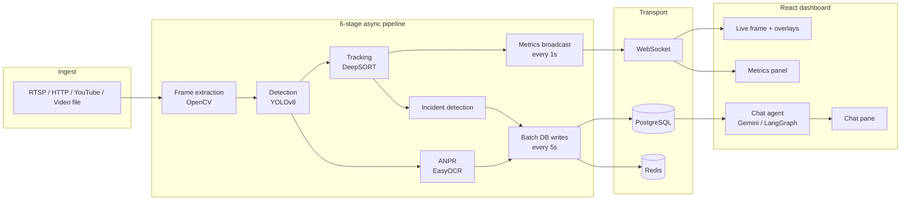

<h1 align="center">Scene Intelligence Platform</h1>

<p align="center">
  <em>Real-time multimodal scene understanding — 80-class detection, pose-based action recognition, live VLM narration, and natural-language watchlist rules over any RTSP, YouTube, HTTP, or uploaded video.</em>
</p>

<p align="center">
  <sub>(Originally built for traffic; now a general scene-monitoring platform. Repo name unchanged for history.)</sub>
</p>

<p align="center">
  <a href="https://github.com/Bharathkondur/Multimodal-Traffic-Intelligence-platform/actions"></a>
  <a href="https://www.python.org/downloads/"></a>
  <a href="https://www.docker.com/"></a>
  <a href="https://opensource.org/licenses/MIT"></a>
</p>

<p align="center">
  <!-- TODO: replace with recorded hero GIF (see docs/RECORDING_GUIDE.md) -->
  
</p>

<p align="center">
  <strong><a href="https://youtu.be/TODO">▶ Watch the 60-second demo</a></strong> &nbsp;·&nbsp;
  <strong><a href="https://bharathkondur.github.io/projects/multimodal-traffic-intelligence.html">Project page</a></strong> &nbsp;·&nbsp;
  <strong><a href="#quick-start">Quick start</a></strong>
</p>

---

## What it does

Point it at a camera or a video and it tells you, in real time, **what is moving, where, how fast, and what just went wrong** — and lets you ask follow-up questions in natural language.

- **Detection** — YOLOv8 over every frame, multi-class (car, truck, bus, motorcycle, bicycle, person).
- **Tracking** — DeepSORT with persistent track IDs across occlusion.
- **ANPR** — EasyOCR-based license plate extraction every 3rd frame per detection.
- **Incident detection** — stopped-vehicle, congestion, crowd, and collision heuristics running concurrently.
- **Live streaming** — RTSP, RTMP, HTTP(S), YouTube (resolved via yt-dlp), webcam, or uploaded MP4/WebM/MOV.
- **Chat-over-data** — Gemini-backed agent answers natural-language questions against live detections and incidents (*"How many trucks went through between 14:00 and 14:15?"*).
- **Dashboard** — React + Tailwind UI with live frame overlay, running metrics, Recharts timelines, and an incidents log.

## Demo

[](https://youtu.be/TODO)

*Click to watch — unlisted YouTube, no audio track required.*

## Quick start

One command, three services, no manual setup:

```bash
git clone https://github.com/Bharathkondur/Multimodal-Traffic-Intelligence-platform.git
cd Multimodal-Traffic-Intelligence-platform
cp .env.example .env          # add your GOOGLE_API_KEY for chat (optional)
docker compose up --build
```

Then open:

| URL | What it is |
|---|---|
| `http://localhost:3000` | React dashboard |
| `http://localhost:8000/docs` | FastAPI OpenAPI (Swagger) |
| `http://localhost:3001` | Grafana (admin / admin) |

Try a stream:

1. Paste an RTSP URL, a YouTube link, or upload a video on the **Add Source** panel.
2. Watch detections, plates, tracks, and metrics stream into the dashboard.
3. Ask the chat pane *"summarise the last five minutes"*.

## Architecture



Six asyncio stages run concurrently per session: **frame extraction → detection → tracking → incident detection → metrics broadcast → batched DB writes**, with a back-pressure cap of 100 frames on the detection queue. See `backend/stream/processor.py` for the core loop.

## Tech stack

**Vision** YOLOv8 · DeepSORT · EasyOCR · OpenCV
**Backend** FastAPI · asyncio · SQLAlchemy 2.0 (async) · asyncpg · Alembic
**Data** PostgreSQL 16 · Redis 7
**AI / Agents** LangGraph · LangChain · Gemini 2.5 Flash
**Frontend** React 18 · Vite · TailwindCSS · Recharts · WebSocket
**Ops** Docker Compose · Nginx · Grafana · Prometheus
**Ingest** yt-dlp (YouTube URL resolution) · OpenCV VideoCapture (RTSP/HTTP/file)

## Performance (laptop, CPU-only)

Measured on MacBook Pro M2 (no discrete GPU), 720p video:

| Metric | Value |
|---|---|
| Frame processing rate | 12–15 FPS |
| End-to-end detection latency | 70–110 ms |
| WebSocket frame rate to UI | 15 FPS @ 1280×720 JPEG q60 |
| DB write amplification | 1 batch per 5 s (50 rows/batch) |
| Sustained streams | 2 concurrent on M2, 4+ with GPU |

With a CUDA-capable GPU the detection stage drops to ~20 ms and you can run 6+ concurrent streams.

## Features at a glance

| Category | Details |
|---|---|
| **Ingest** | RTSP / RTMP / HTTP(S) / YouTube (yt-dlp) / webcam / uploaded video |
| **Detect** | 6 vehicle+pedestrian classes, configurable confidence threshold |
| **Track** | Persistent DeepSORT IDs, trail rendering, re-identification across occlusion |
| **Read** | License plate OCR (every 3rd frame per detection) with confidence scoring |
| **Alert** | Stopped vehicles, congestion, crowd, accident heuristics |
| **Query** | LLM chat bound to live detection context (Gemini backend) |
| **Store** | Append-only event log in Postgres, 5 s batched writes |
| **Show** | React dashboard with live overlays, running metrics, incident timeline |
| **Monitor** | Grafana dashboards + Prometheus metrics out of the box |

## Repository layout

```
backend/            FastAPI app, async pipeline, DB, agents
  api/              REST + WebSocket routes, Pydantic schemas
  detection/        YOLOv8 detector, DeepSORT tracker, ANPR
  stream/           StreamProcessor (the 6-stage async loop)
  processing/       Detection + stream pipeline entry points
  agents/           LangGraph RAG agent + tools
  database/         SQLAlchemy models, Alembic migrations
frontend/           React + Vite dashboard
grafana/            Dashboards + datasources
docker-compose.yml  One-command local stack
docs/               Strategy, demo script, recording guide
```

## Roadmap

- [x] RTSP / YouTube / HTTP live ingest (see `backend/processing/stream.py`)
- [x] EasyOCR ANPR integrated into the detection stage
- [x] LLM chat-over-data with Gemini
- [ ] Multi-camera fused view
- [ ] ONNX / TensorRT export for ~3× inference speedup
- [ ] Plate-match watchlist alerts
- [ ] Horizontal scaling via Redis pub/sub fan-out

## Built by

**Bharath Kumar Kondur** — CV/LLM engineer, 2 yrs working on plate detection + multi-object tracking. Open to smart-city, ADAS, and production-CV roles in the EU.

[Portfolio](https://bharathkondur.github.io/) · [LinkedIn](https://www.linkedin.com/in/bharathkondur/) · bharathkumarkondur@gmail.com

## License

MIT — see [LICENSE](LICENSE).
